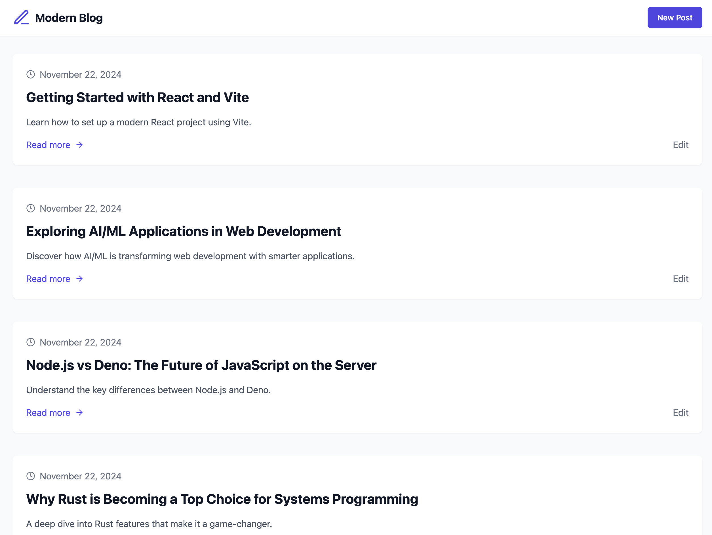

## Modern Blog

An ultra-simple blog site built with the following technologies:
 * React (Vite)
 * TypeScript
 * Tailwind CSS
 * Express
 * PostgreSQL
 * React Query
 * React Hook Form

Feel free to use this project as a starting point to create something amazing! 🚀

### Getting Started

#### Installation

```
npm i
```

#### Database

Once you have postgreSQL up & server running, start by creating a database and table

```
psql -h localhost -U postgres -f db/init.sql
psql -h localhost -U postgres -f db/samples.sql
```

Update `.env` or create `.env.local` and provide `DATABASE_URL` for server's [connection URI](https://www.postgresql.org/docs/current/libpq-connect.html#LIBPQ-CONNSTRING-URIS)

#### API Server

```
npm run dev:server
```

#### Frontend

```
npm run dev
```

Enjoy!

---



### Wishlist
* [ ] Tests
* [ ] Integrate storybook
* [ ] Move frontend out of root
* [ ] Scalable codebase for server

### Disclaimer
This project is not intended for production use as-is. The current implementation allows anyone to create, edit, and view posts—no authentication or access control is provided.

The primary goal is to demonstrate the use of this tech stack and showcase a simple end-to-end CRUD (Create, Read, Update, Delete) application. It's designed to serve as a learning tool or a foundation/boilerplate for your own projects.

Note: This repository is configured to serve files directly from the root of the running app. For example, you can access the LICENSE file by navigating to http://localhost:5173/LICENSE, as it is served from the root of the GitHub repository.

